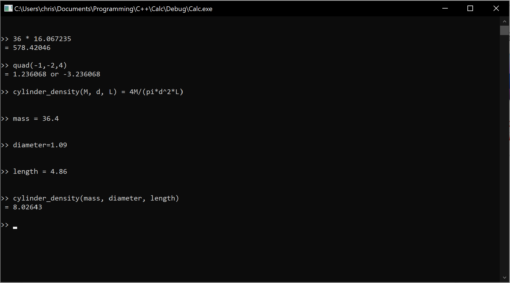

# Calc

A command-line calculator that lets you easily define your own functions and variables.

[Contributions](https://github.com/wheelercj/Calc/blob/master/docs/CONTRIBUTING.md) are welcome.

To compile the source code, you will need at least a C++17 compiler. [Here](https://drive.google.com/open?id=1mLnwM1aZPquCDheh4-TCCNiOytMtqfzz)'s how to switch compilers in Visual Studio.

### Default Variables
| Name | Value | Info |
| ---- | ----- | ---- |
| `ans` | 0 | Automatically changes to the latest answer that is not an error message |
| `pi` | 3.141592653589793238462643383279502884197169399375105820974 | |
| `e` | 2.718281828459045235360287471352662497757247093699959574966 | Euler's number |
| `g` | 9.80665 | Acceleration due to gravity near Earth's surface in meters per second squared |
| `phi` | 1.618033988749894848204586834365638117720309179805762862135 | Golden Ratio |

### Default Functions
| Name | Parameters | Formula | Info |
| ---- | ---------- | ------- | ---- |
| `help` | (`variable or function name`) | C++ | Get help with a variable or function |
| `help` | () | C++ | Get help with all variables and functions |
| `setprecision` | (`x`) | C++ | Adjust the precision of answers |
| `sqrt` | (`x`) | C++ | Square root |
| `cbrt` | (`x`) | C++ | Cube root|
| `abs` | (`x`) | C++ | Absolute value |
| `pow` | (`x`, `y`) | `x^y` | Power function |
| `exp` | (`x`) | `e^x` | Exponential function |
| `ln` | (`x`) | C++ | Logarithm base e |
| `log` | (`x`) | `ln(x)/ln(10)` | Logarithm base 10 |
| `lg` | (`x`) | `ln(x)/ln(2)` | Logarithm base 2 |
| `logb` | (`base`, `x`) | `ln(x)/ln(base)` | Logarithm base b |
| `round` | (`x`) | C++ | Round to the nearest integer |
| `ceil` | (`x`) | C++ | Round up |
| `floor` | (`x`) | C++ | Round down |
| `sin` | (`x`) | C++ | Sine |
| `cos` | (`x`) | C++ | Cosine |
| `tan` | (`x`) | C++ | Tangent |
| `csc` | (`x`) | `1/sin(x)` | Cosecant |
| `sec` | (`x`) | `1/cos(x)` | Secant |
| `cot` | (`x`) | `1/tan(x)` | Cotangent |
| `asin` | (`x`) | C++ | Inverse sine |
| `acos` | (`x`) | C++ | Inverse cosine |
| `atan` | (`x`) | C++ | Inverse tangent |
| `acsc` | (`x`) | `asin(1/x)` | Inverse cosecant |
| `asec` | (`x`) | `acos(1/x)` | Inverse secant |
| `acot` | (`x`) | `atan(1/x)` | Inverse cotangent |
| `sinh` | (`x`) | C++ | Hyperbolic sine |
| `cosh` | (`x`) | C++ | Hyperbolic cosine |
| `tanh` | (`x`) | C++ | Hyperbolic tangent |
| `csch` | (`x`) | `1/sinh(x)` | Hyperbolic cosecant |
| `sech` | (`x`) | `1/cosh(x)` | Hyperbolic secant |
| `coth` | (`x`) | `1/tanh(x)` | Hyperbolic cotangent |
| `asinh` | (`x`) | C++ | Inverse hyperbolic sine |
| `acosh` | (`x`) | C++ | Inverse hyperbolic cosine |
| `atanh` | (`x`) | C++ | Inverse hyperbolic tangent |
| `acsch` | (`x`) | `asinh(1/x)` | Inverse hyperbolic cosecant |
| `asech` | (`x`) | `acosh(1/x)` | Inverse hyperbolic secant |
| `acoth` | (`x`) | `atanh(1/x)` | Inverse hyperbolic cotangent |
| `rand` | () | C++ | Generate a random number |
| `quad` | (`a`, `b`, `c`) | C++ | Quadratic formula |
| `erf` | (`x`) | C++ | Error function |
| `erfc` | (`x`) | C++ | Complementary error function |
| `tgamma` | (`x`) | C++ | Gamma function |
| `lgamma` | (`x`) | C++ | Log gamma function |
| `cylinder_volume` | (`radius`, `height`) | `pi*r^2*h` | |
| `sphere_volume` | (`radius`) | `(4/3)pi*r^3` | |
| `cone_volume` | (`radius`, `height`) | `(h/3)pi*r^2` | |
| `pyramid_volume` | (`Base area`, `height`) | `B*h/3` | |
| `simple_interest` | (`Principal amount`, `rate`, `time`) | `Prt` | |
| `compound_interest` | (`Principal amount`, `rate`, `time`, `number of compounds`) | `P(1+r/n)^(nt)` | |
| `present_value` | (`Cash flow at period 1`, `rate of return`, `number of periods`) | `C/(1+r)^n` | |
| `future_value` | (`Cash flow at period 0`, `rate of return`, `number of periods`) | `C(1+r)^n` | |

### Operators
| Symbol | Name |
| ------ | ---- |
| `=` | Set equal to |
| `(` | Open parenthesis |
| `)` | Close parenthesis |
| `!` | Factorial |
| `^` | Exponent |
| `*` | Multiplication |
| `/` | Division |
| `+` | Addition |
| `-` | Either subtraction or negation |
| `%` | Modulo |
| `==` | Is equal to |
| `!=` | Is not equal to |
| `>=` | Is greater than or equal to |
| `<=` | Is less than or equal to |
| `>` | Is greater than |
| `<` | Is less than |
